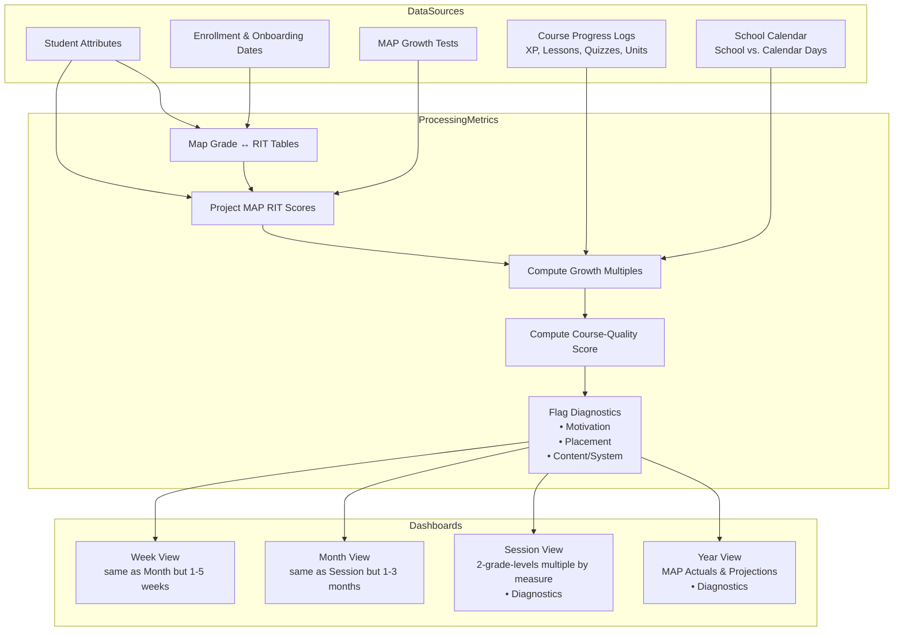

# TimeBack Dashboards – BrainLift Specification

---

## 1. Purpose & Vision

Two-Hour Learning promises **2× learning in 2 hours per day** for every student.  
TimeBack’s dashboards supply the closed-loop feedback needed to honor that promise by:

1. Showing **who _is_ and who _is not_ learning 2×** in each subject.
2. Pin-pointing **_why_ a student is not on track** (motivation, placement, curriculum, or system).
3. Surfacing insights at four time-scales (year, session, month, week) so guides can intervene early.

> *If the student isn’t learning, the system—not the student—is responsible.*

---

## 2. Core Principles

| # | Principle | Rationale |
|---|-----------|-----------|
| 1 | **MAP Growth is the master metric** | Third-party validation of 2× learning; trusted by parents. |
| 2 | **Course Progress is the leading metric** | Needed for weekly/monthly feedback; ≥2 grade-levels / yr ⇒ ≥2× MAP. |
| 3 | **Waste % explains behavior issues** | Frames the problem as fixable habits, expressed in minutes parents understand. |
| 4 | **Data are adjusted for school calendar & enrollment** | Students are not penalized for breaks or pre-enrollment periods. |

---

## 3. Depth of Knowledge (DOK) Insights

### 3.1 DOK-4 — Spiky POVs

* NWEA MAP Growth serves as an external report card for (≈) half-grade accuracy.
* Highest grade-level mastered predicts MAP within ½ grade-level; adding course progress reaches MAP SE (±3 RIT).
* Waste % (time not spent in productive learning) is the clearest lever for parents & students.

### 3.2 DOK-3 — Operational Insights

* MAP given only 3×/yr ⇒ use **course progress** for shorter cycles.
* 2 GL / yr standard on course progress comfortably satisfies 2× MAP.
* School days ≠ calendar days; store academic calendar (IMS → Ed-Fi rows) for exact day counts.
* Track **enrollment date** & **onboarding completion per subject** to avoid unfair baselines.

---

## 4. Key Metrics & Thresholds

| Metric | Green | Yellow | Red | Notes |
|--------|-------|--------|-----|-------|
| MAP Growth Multiple | ≥ 2.0 | 1.0 – 1.99 | < 1.0 | Actual or projected. |
| GL / yr Pace (XP) | ≥ 2.0 | 1.0 – 1.99 | < 1.0 | School-year-to-date. |
| Waste % | 0 % | 1 – 24 % | ≥ 25 % | Display only 0 %, 25 %, 50 %, 75 %, 100 %. |
| Accuracy | 80 – 90 % | — | < 80 % or > 90 % | > 90 % ⇒ too easy; < 80 % ⇒ too hard. |
| Min/XP | < 1.2 | 1.2 – 1.5 | > 1.5 | Proxy for learning efficiency. |

---

### 4.1 Calculations

* **2× MAP Growth Multiple**  
  \[(Δ RIT_student) / (Δ RIT_median)\]
* **GL / yr Pace (lessons)**  
  \[(Lₘ × Dᵧ) / (L_g × Dₚ)\] where:
  * Lₘ = lessons mastered in period
  * L_g = lessons per GL (use highest GL touched)
  * Dₚ = enrolled school days in period
  * Dᵧ = 180
* **Projected RIT** uses: previous RIT, highest grade mastered, course progress, mapping tables per subject.
* **Course Quality Score** discounts progress (e.g., first-try = 1.0, requires 2 attempts = 0.5).

---

## 5. Dashboard Views

### 5.1 Simple Student-Subject Card

* MAP: achievement percentile, 2× status, growth multiple.
* Course Progress GL / yr (XP).
* Waste %, XP/day, Min/XP, Accuracy.
* Color coding: green/yellow/red by thresholds above.

### 5.2 Yearly Views

1. **Overall (School Year)**  
   Dropdown school year → evaluates 2× MAP, 2 GL / yr, Motivation, Placement, Curriculum flags.
2. **MAP Actuals** – choose interval (YoY, SYTD, last ½ yr).  Table per student-subject.
3. **MAP Projections** – same table but projected scores since last MAP.

### 5.3 Session / Month / Week

* Same columns as “Year – MAP Projections”.
* Dropdown selects current-to-date or last N complete periods (5 sessions, 3 months, 5 weeks).

### 5.4 Simplified Deep-Dive Template (Student/Parent-Facing)

| Section | Contents |
|---------|----------|
| **Problem Header** | Student, campus, age-grade, level, author, date range, key question. |
| **Subject Panels (×4)** | 1) Current Status table  2) Learning Metrics table  3) AI-generated summary focusing on primary cause. |
| **Color Coding** | Red/Green only (no yellow) to avoid nit-picking; show precision only to supported accuracy. |

---

## 5.5 Diagnostics Criteria

Below rules standardize how dashboard flags are set.  All thresholds are subject-level configurable but defaults are shown.

| Flag | Definition | Logic / Threshold |
|------|------------|-------------------|
| **Projected to Learn 2X?** | On track to hit 2× MAP growth by end of selected period. | Use MAP **Projections** growth multiple ≥ 2.0. |
| **2X Learning? (Actual)** | Achieved ≥ 2× MAP in the most recent actual test window (e.g. Spring-to-Spring). | MAP **Actuals** growth multiple ≥ 2.0. |
| **Bad Test Day?** | Indicates a potentially unrepresentative MAP score. | Student has **no retake** _and_ (score < any prior MAP _or_ score < projection – 4 RIT). |
| **Low Minutes?** | Student did not work the agreed daily minutes average. | `total_minutes / enrolled_school_days < target_daily_minutes`. |
| **High Waste?** | ≥ 25 % of logged minutes are classified as waste. | Waste % rounded to nearest 0 %, 25 %, 50 %, 75 %, 100 %. |
| **2 GL/yr Pace?** | Learning pace based on lessons ≥ 2 grade levels / yr. | `pace_gl_per_year = (Lm × 180) / (Lg × Dp)` ≥ 2.0. |

A student who is **not at 2×** and has **no Motivation or Placement flags** is automatically assigned a **Curriculum/System** flag.

---

## 5.6 Post-Test Analysis (PTA)

_For each incorrectly answered standardized-test question:_

1. **Achieved pp100 on a lesson?**  
   • Yes if student mastered a _post-practice 100 %_ lesson covering the tested skill.
2. **Low accuracy on pp100 lesson?**  
   • Flag if lesson accuracy < 90 %.
3. **Lesson rigor & format checks**  
   • Compare lesson question type and difficulty to test item using rubric.
4. **Could the student have forgotten?**  
   • Build an **exposure timeline** from course start to test date.  
   • Compute **exposure score** (probability of correct recall) using spaced-repetition decay; flag if score < 0.7.

PTA output feeds back into **Course Quality Score** and guides lesson remediation priorities.

---

## 6. Dataset Requirements

* **Dimensions**: student, subject, time-period.
* **Student Attributes**: campus, age grade, level, enrollment date, onboarding completion per subject.
* **Current Achievement**: highest mastered grade, knowledge grade, rostered grade, current course & % progress (XP, lessons, quizzes, units).
* **MAP**: latest RIT, percentile, R50, R90.
* **Time-Period Facts**:
  * start_date, end_date, school_days
  * enrolled_school_days, total_minutes
* **Measurement Method**: MAP Actuals, MAP Projections, Course Progress.
* **Growth Multiple** vs national norm (MAP) or 1 GL / yr (course progress).
* **Diagnostic Flags**: motivation, placement, curriculum/system.

A high-level entity-relationship diagram is planned in `docu/dashboard-dataset.er`.  
### 6.1 Dataset Flow Diagram

---

## 7. Why “Waste %” Works with Parents

* Frames issue as a **behavior** (fixable) not ability (innate).  
* Direct link to the **2× promise** – less waste ⇒ same learning in ≤2 hrs.  
* Expressed in **minutes**, universally understood.  
* Already captured in app logs ⇒ objective & reproducible.

---

## 8. Glossary

| Term | Definition |
|------|------------|
| **2× Learning** | Student’s growth multiple ≥2.0 relative to national MAP norm. |
| **GL / yr** | Grade levels mastered per 180 school-day year. |
| **Waste %** | % of on-task time not spent in productive learning activities. |
| **Knowledge Grade** | Highest mastered grade + 1. |
| **DOK** | Webb’s Depth of Knowledge (Levels 1–4). |
| **MAP SE** | Standard error of MAP (~3–4 RIT). |

---

_Last updated: <!-- CURSOR: keep this line for automated date insertion -->_ 