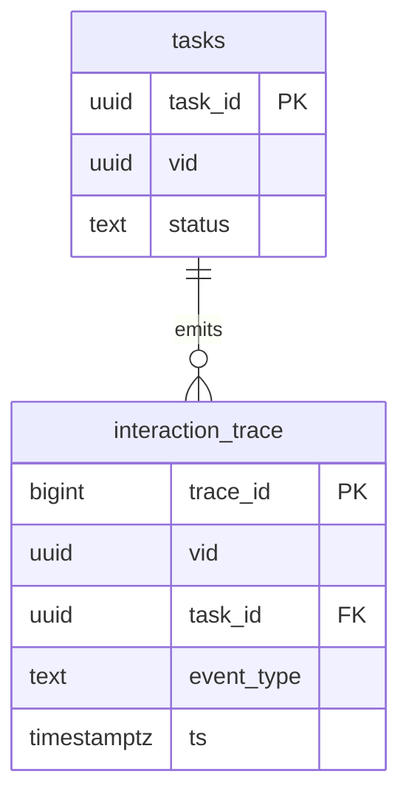

# TimeBack Website – Agent-Action / Task Schema (Marketing Site)

*Created: 2025-07-20*

## Purpose
Define the minimal data contract for any “action” the LLM-powered agent can schedule for a visitor on the **public marketing site**.  Actions are rendered as personalised blocks (immediate) or queued follow-ups (e-mail, reminder banner).

## 1. JSON Payload (canonical)
```jsonc
{
  "task_id": "uuid",          // server-generated
  "vid": "uuid",              // visitor id (cookie)
  "action_type": "show_block", // show_block | schedule_email | analytic_ping
  "summary": "Send grade-4 reminder banner",
  "payload": {
    "block_id": "before_after_chart",
    "ttl": 3600
  },
  "status": "pending",        // pending | in_progress | completed | cancelled
  "created_at": "2025-07-20T12:00:00Z",
  "due_at": null               // optional (follow-ups)
}
```

## 2. SQL DDL  (PostgreSQL ≥ 15)
```sql
CREATE TABLE tasks (
  task_id        uuid PRIMARY KEY DEFAULT gen_random_uuid(),
  vid            uuid NOT NULL,
  action_type    text NOT NULL CHECK (action_type IN ('show_block','schedule_email','analytic_ping')),
  summary        text NOT NULL,
  payload        jsonb NOT NULL,
  status         text NOT NULL CHECK (status IN ('pending','in_progress','completed','cancelled')),
  created_at     timestamptz NOT NULL DEFAULT now(),
  due_at         timestamptz,
  completed_at   timestamptz,
  cancelled_at   timestamptz
);

-- Indexes
CREATE INDEX tasks_vid_status_idx      ON tasks (vid, status);
CREATE INDEX tasks_due_at_idx          ON tasks (due_at);
CREATE INDEX tasks_payload_gin_idx     ON tasks USING GIN (payload);
```

## 3. Relation to `interaction_trace`


## 4. Lifecycle State Machine
```
pending → in_progress → completed
     ↘──────────────┘
     cancelled
```
Transition rules:
* Only `pending` tasks can move to `in_progress` or `cancelled`.
* Only `in_progress` can move to `completed`.

## 5. Open Questions
1. Do we need per-step subtasks (`steps[]`) now or can we postpone?
2. Should `payload` be versioned similar to Memory Graph pattern?

---
*Prepared by AI assistant – feedback welcome via PR.* 